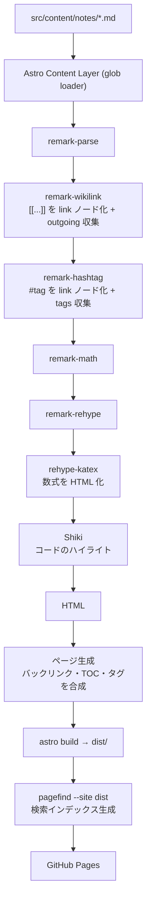

# ydah notes サイト 設計書

Astro + GitHub Pages で、ydah 個人の「エバーグリーンノート」置き場を公開するための設計。
64p.org の `/notes/` の思想（原子性・概念指向・密度の高いリンク・連想的オントロジー）をそのまま引き継ぎつつ、
実装は Perl の自作ジェネレータではなく Astro に置き換える。

> 注: 本書に書かれたライブラリのバージョンや GitHub Actions の仕様は執筆時点のもの。
> 実装前に各公式ドキュメントで最新の記法を確認すること。

---

## 1. 目的とスコープ

### 目的

- ちょっと調べたこと・AI の調査結果を、使い捨てにせず**育っていく知識のネットワーク**として蓄積する。
- ちゃんとした記事はブログ側に書くので、ここはラフなメモでよい。読者への配慮は不要。
- Obsidian Publish 風の見た目（左サイドバー = ノート一覧・検索、右サイドバー = 目次・バックリンク）。

### やること（スコープ）

- Markdown ソースからの静的サイト生成（Astro）
- `[[wikilink]]` による相互リンクと、自動バックリンク
- 本文中 `#tag` によるフラットな分類、タグ一覧ページ・タグ別ページ
- 全文検索（タグでの絞り込みつき）
- mermaid 図・数式（KaTeX）・シンタックスハイライト
- ダーク/ライトテーマ切替
- GitHub Actions による GitHub Pages への自動デプロイ

### やらないこと（非スコープ）

- CMS・管理画面（エディタは Obsidian / VS Code / エディタ何でも、ソースは git 管理）
- コメント欄、アクセス解析、認証
- 複数人での同時編集ワークフロー（あくまで個人用）
- サーバサイド処理（完全に静的。検索もクライアントサイド）

---

## 2. 要件

### 機能要件

| ID | 要件 | 優先度 |
|----|------|--------|
| F-1 | `src/content/notes/*.md` を書けばページが生成される | 必須 |
| F-2 | `[[file-name]]` / `[[file-name\|表示テキスト]]` でノート間リンク | 必須 |
| F-3 | リンク先が存在しない場合、ビルド時に警告を出す（壊れリンクの検知） | 必須 |
| F-4 | リンクされた側にバックリンク（🔗 リンクされているノート）を自動表示 | 必須 |
| F-5 | 本文中の `#tag` をタグページへのリンクに変換 | 必須 |
| F-6 | タグ一覧ページ（タグクラウド）とタグ別一覧ページ | 必須 |
| F-7 | 全文検索（サイドバーまたは専用ページ） | 必須 |
| F-8 | 検索結果をタグで絞り込める | 推奨 |
| F-9 | コードブロックのシンタックスハイライト | 必須 |
| F-10 | mermaid 記法の図表描画 | 推奨 |
| F-11 | KaTeX による数式描画 | 推奨 |
| F-12 | 作成日・更新日の表示 | 必須 |
| F-13 | ダーク/ライトテーマ切替（設定を記憶する） | 推奨 |
| F-14 | RSS / sitemap.xml | 推奨 |
| F-15 | ノート内の見出しから目次（TOC）を生成 | 推奨 |

### 非機能要件

- **ビルド時間**: ノート 500 本程度までは数十秒以内に収まること。
- **依存の少なさ**: 個人メモなので、メンテできなくなる重い依存（ヘッドレスブラウザ等）は避ける。
- **ソースの可搬性**: Markdown 単体で読めること。Astro をやめても中身が生き残る形にする。
- **リンク切れゼロ**: `[[...]]` の解決失敗はビルドログで気づける。
- **JS なしでも読める**: 本文・リンク・タグは静的 HTML。JS は検索・テーマ切替・mermaid のみに使う。

---

## 3. 技術選定

| 領域 | 採用 | 理由 / 代替案 |
|------|------|----------------|
| SSG | **Astro 5**（Content Layer API） | Markdown 中心のサイトに最適。出力はデフォルトで JS ゼロ。`glob()` ローダで `src/content/notes/**/*.md` を取り込む |
| パッケージマネージャ | npm（pnpm でも可） | CI での再現性を優先するなら lockfile をコミットすればどちらでもよい |
| 全文検索 | **Pagefind** | ビルド後の HTML を静的解析してインデックスを作る。インデックスが分割ロードされるのでノートが増えてもフロントの初期ロードが太らない。`data-pagefind-filter` でタグ絞り込みも実現できる（F-8）|
| 検索の代替案 | Fuse.js + 自前 JSON | 実装は自由になるが、ノート全文を JSON にすると増えるほど重くなる。数十本規模なら十分アリ |
| wikilink | **自作 remark プラグイン** | 既存プラグインは仕様が微妙に合わない（表示テキストの解決、リンクグラフの収集）。remark AST を触れば**コードブロック内は自動的に対象外**になるので、正規表現でソースを舐めるより安全 |
| `#tag` | **自作 remark プラグイン** | 同上。`text` ノードだけを対象にすればコード・数式内での誤爆がない |
| バックリンク | ビルド時に全ノートを走査してリンクグラフを構築 | Astro の `getCollection()` で全件取れるので、逆引き Map を作るだけ |
| 数式 | remark-math + rehype-katex | **ビルド時に HTML 化**するので、閲覧時に KaTeX の JS を読まなくてよい |
| 図表 | mermaid.js のクライアントサイド遅延ロード | `rehype-mermaid` でビルド時 SVG 化もできるが Playwright が必要になり重い。図を含むページだけ CDN から遅延ロードする方式を採る |
| ハイライト | Shiki（Astro 組み込み） | 追加依存なし。ビルド時に色付き HTML になるのでランタイム JS 不要 |
| スタイル | 素の CSS（CSS 変数でテーマ切替） | Tailwind でもよいが、個人メモサイトに設定ファイルを増やす利点が薄い |
| ホスティング | GitHub Pages + GitHub Actions | 無料・git push で反映 |

### バージョン・作成日の扱い

64p.org 版は lefthook の pre-commit フックで frontmatter に `created` / `updated` を書き込んでいた。
Astro 版でも同じ方式を推奨する（**git 履歴に依存しないのでビルド環境を選ばない**）。

- 代替案として「CI で `git log` から日付を取る」方式もあるが、その場合 `actions/checkout` に `fetch-depth: 0` が必須。
  shallow clone だと日付が全部同じになる罠がある。
- frontmatter を持つことで、Obsidian など外部ツールからも日付が見える利点がある。

---

## 4. ディレクトリ構成

```
ydah-notes/
├── .github/
│   └── workflows/
│       └── deploy.yml          # GitHub Pages デプロイ
├── src/
│   ├── content/
│   │   └── notes/              # ★ ノートの Markdown ソース（ここだけ触れば運用できる）
│   │       ├── evergreen-notes.md
│   │       ├── moc.md
│   │       └── ...
│   ├── content.config.ts       # コレクション定義 + zod スキーマ
│   ├── components/
│   │   ├── Sidebar.astro       # 左: 検索ボックス・ノート一覧・タグ一覧への導線
│   │   ├── Backlinks.astro     # 🔗 リンクされているノート
│   │   ├── TableOfContents.astro
│   │   ├── TagList.astro
│   │   ├── NoteCard.astro
│   │   ├── ThemeToggle.astro
│   │   └── Search.astro        # Pagefind UI のマウント先
│   ├── layouts/
│   │   ├── BaseLayout.astro
│   │   └── NoteLayout.astro
│   ├── lib/
│   │   ├── remark-wikilink.mjs # [[...]] → <a> 変換 + リンク収集
│   │   ├── remark-hashtag.mjs  # #tag → <a> 変換 + タグ収集
│   │   ├── notes.ts            # ノート取得・リンクグラフ・タグ集計のユーティリティ
│   │   └── slug.ts             # ファイル名/タグ → URL slug の正規化
│   ├── pages/
│   │   ├── index.astro         # トップ（最近更新したノート）
│   │   ├── notes/
│   │   │   ├── index.astro     # ノート一覧
│   │   │   └── [slug].astro    # ノート本体
│   │   ├── tags/
│   │   │   ├── index.astro     # タグクラウド
│   │   │   └── [tag].astro     # タグ別一覧
│   │   ├── search.astro        # 検索専用ページ
│   │   ├── rss.xml.ts
│   │   └── 404.astro
│   └── styles/
│       └── global.css          # CSS 変数でライト/ダークを定義
├── public/                     # 画像・favicon など
├── scripts/
│   └── update-note-dates.mjs   # pre-commit で created/updated を付与
├── astro.config.mjs
├── lefthook.yml
├── package.json
└── README.md                   # ノートの書き方ルール（旧 CLAUDE.md 相当）
```

---

## 5. データモデル

### frontmatter

`src/content.config.ts` の zod スキーマで検証する。**タイトルは frontmatter ではなく本文 1 行目の `# 見出し`** から取ってもよいが、
Astro では frontmatter に持たせたほうが一覧ページで扱いやすい。移行しやすさを優先するなら「frontmatter に title があればそれ、なければ本文の最初の h1」というフォールバックを実装する。

```yaml
---
title: エバーグリーンノート        # 省略可（省略時は本文の h1 を使う）
created: 2026-08-09               # pre-commit フックが自動付与
updated: 2026-08-17               # pre-commit フックが自動更新
draft: false                      # true なら本番ビルドから除外（任意）
aliases: [evergreen, 常緑ノート]   # 別名からの [[...]] 解決に使う（任意）
---
```

- `tags` は frontmatter に持たせず、**本文中の `#tag` を正とする**（64p.org 版の仕様を踏襲）。
  frontmatter とインラインの二重管理を避けるため。
- `draft: true` は `import.meta.env.PROD` のときだけフィルタして除外する。

### 内部で組み立てるデータ構造

```ts
type Note = {
  slug: string;         // ファイル名から生成（kebab-case そのまま）
  title: string;
  created: Date;
  updated: Date;
  tags: string[];       // 本文から抽出・正規化済み
  outgoing: string[];   // このノートが [[...]] で参照している slug
  headings: Heading[];  // TOC 用
};

type LinkGraph = {
  bySlug: Map<string, Note>;
  backlinks: Map<string, { slug: string; title: string }[]>; // 逆引き
  tagCounts: Map<string, number>;
};
```

---

## 6. ページ構成とルーティング

| URL | 内容 |
|-----|------|
| `/` | サイト説明 + 最近更新したノート 10 件 + よく使うタグ |
| `/notes/` | 全ノート一覧（更新日降順 / タイトル昇順を切替できると尚可） |
| `/notes/<slug>/` | ノート本体。右カラムに TOC、本文下にバックリンク |
| `/tags/` | タグクラウド（出現数に応じてフォントサイズを変える） |
| `/tags/<tag>/` | そのタグを含むノート一覧 |
| `/search/` | Pagefind UI による検索（タグフィルタ付き） |
| `/rss.xml` | 更新フィード |
| `/sitemap-index.xml` | `@astrojs/sitemap` が自動生成 |
| `/404` | 存在しないパス |

### slug とタグの正規化ルール

- ノートの slug: ファイル名（拡張子なし）をそのまま使う。英数字とハイフンの kebab-case を強制（ビルド時にチェック）。
- タグの slug:
  - ASCII 英字を含むタグは **小文字に正規化**（`#AI` と `#ai` は同一タグ）。
  - 日本語タグは正規化しない（表記ゆれは書き手が気をつける）。
  - URL には `encodeURIComponent` した値を使う（`/tags/%E6%88%A6%E5%9B%BD%E6%99%82%E4%BB%A3/`）。
    表示は元の文字列。Astro の `getStaticPaths` に渡す `params` はエンコード前の文字列を渡せば
    出力時に自動でエンコードされる。

### `#tag` の認識ルール（64p.org 版の仕様を踏襲）

- `#` の直後は Unicode の「文字」（英字または日本語など）。数字・アンダースコア始まりは不可（`#1234` のような Issue 番号を誤認しない）。
- 2 文字目以降は英数字・`_`・`-`・Unicode 文字。
- 直前が英数字なら無視（`foo#bar`、`C#`、URL フラグメント対策）。句読点・括弧・行頭・空白の直後は認識する。
- コードブロック・インラインコード・数式内では展開しない。
  → remark AST の `text` ノードだけを走査することで**自然にこの条件を満たす**（正規表現で生ソースを触らない）。

---

## 7. Markdown 処理パイプライン



### remark プラグインの責務

**`remark-wikilink.mjs`**

1. `text` ノードを走査し `[[target]]` / `[[target|label]]` にマッチする箇所を分割。
2. `link` ノード（`url: /notes/<target>/`, `children: [text(label ?? title)]`）に置換。
3. 解決できたかどうかを `file.data.astro.frontmatter` 相当の場所、または vfile の `data` に記録。
4. 解決できなかった場合は `file.message()` で警告を出す（`--strict` 相当のオプションで失敗にしてもよい）。
5. リンク先タイトルの解決には、事前にビルドした「slug → title」の索引が必要。
   → `astro.config.mjs` の読み込み時に `src/content/notes/` を同期的に走査して索引を作り、プラグインに渡す。
   （ノートが増えても数百ファイルなら一瞬。ここだけは Astro のコレクション API ではなくファイル走査を使う）

**`remark-hashtag.mjs`**

1. `text` ノードを走査し、上記ルールに合致する `#tag` を `link` ノード（`url: /tags/<encoded>/`）へ置換。
2. 抽出したタグを vfile data に蓄積し、Astro 側で `getCollection()` の結果と突き合わせる。

> ノート一覧やタグ集計にタグ情報が必要なので、「Markdown をレンダリングしないとタグが分からない」状態にならないよう、
> **タグ抽出だけは軽量な独立関数としても実装**し、`lib/notes.ts` から生ソースに対して呼べるようにする。
> （remark プラグインと同じ正規表現を共有し、コードブロック部分だけ除去してから適用する）

---

## 8. 検索の設計（Pagefind）

### 仕組み

`astro build` が出力した `dist/` の HTML を Pagefind が静的解析し、`dist/pagefind/` にインデックスを吐く。
ページ側は `/pagefind/pagefind-ui.js` を読み込んでマウントするだけ。

```
npm run build  →  astro build && pagefind --site dist
```

### インデックス対象の制御

- ノート本文の要素に `data-pagefind-body` を付け、サイドバーやフッターを検索対象から外す。
- タイトルは `data-pagefind-meta="title"`。
- **タグ絞り込み（F-8）**: タグ表示部に `data-pagefind-filter="tag"` を付けると、
  Pagefind UI に自動でフィルタ UI（チェックボックス）が出る。

```html
<article data-pagefind-body>
  <h1 data-pagefind-meta="title">{title}</h1>
  <div class="tags">
    {tags.map(t => <a href={tagUrl(t)} data-pagefind-filter="tag">{t}</a>)}
  </div>
  <div class="note-body" set:html={html} />
</article>
```

### 開発時の扱い

`astro dev` は `dist/` を作らないので検索が動かない。運用ではこう回避する。

- 一度 `npm run build` してから `cp -r dist/pagefind public/pagefind` しておく（`public/pagefind` は `.gitignore`）。
- または「dev では検索ボックスを disabled にする」だけでも実用上困らない。

### 代替（ノート数が少ないうち）

`getCollection()` から `{slug, title, tags, body}` の JSON を生成し、Fuse.js でクライアント検索する。
実装は 50 行程度で済むが、全文を 1 ファイルに載せるため 100 本を超えたあたりで初期ロードが重くなる。
**最初から Pagefind にしておくほうが後で移行しなくて済む。**

---

## 9. UI 設計（Obsidian Publish 風）

```
┌──────────────┬────────────────────────────┬──────────────┐
│ 🔍 検索       │  # ノートのタイトル          │  目次         │
│ ─────────    │                            │  - 見出し1    │
│ 📄 ノート一覧  │  本文…                      │  - 見出し2    │
│  - note-a    │                            │              │
│  - note-b    │  #tag1 #tag2                │              │
│ 🏷️ タグ一覧   │                            │              │
│              │  ── 🔗 リンクされているノート ──│              │
│ 🌙 テーマ      │  - note-x                  │              │
└──────────────┴────────────────────────────┴──────────────┘
```

- **レスポンシブ**: 幅 1100px 未満で右カラム（TOC）を本文上部のアコーディオンに畳む。768px 未満で左サイドバーをハンバーガーに。
- **テーマ**: `:root` / `[data-theme="dark"]` の CSS 変数で色を定義。初期値は `prefers-color-scheme`、選択は `localStorage` に保存。
  FOUC を防ぐため `<head>` にインラインの同期スクリプトを 1 つだけ置く。
- **タイポグラフィ**: 日本語本文なので `line-height: 1.8` 前後、本文幅は 40〜45em を上限。
  等幅は `ui-monospace, SFMono-Regular, "SF Mono", Menlo, monospace`。
- **リンクの見分け**: 内部 wikilink・外部リンク・**未解決リンク（赤系＋点線）** を色で区別できるようにする。

---

## 10. ビルドとデプロイ

### GitHub Pages の公開方式

| ケース | リポジトリ名 | 公開 URL | `astro.config.mjs` |
|--------|-------------|----------|--------------------|
| ユーザーサイト | `ydah/ydah.github.io` | `https://ydah.github.io/` | `site` のみ設定、`base` は不要 |
| プロジェクトサイト | `ydah/notes` | `https://ydah.github.io/notes/` | `site` + `base: '/notes'` が**必須** |
| 独自ドメイン | 任意 | `https://notes.example.com/` | `site` に独自ドメイン、`base` 不要、`public/CNAME` を置く |

`base` を設定した場合、**自作リンク生成箇所すべてで base を前置する必要がある**（`import.meta.env.BASE_URL`）。
wikilink プラグインやタグリンクの URL 組み立てでも忘れないこと。ここがプロジェクトサイト構成で最も踏みやすい罠。

### CI

`.github/workflows/deploy.yml` で以下を行う。

1. `actions/checkout`（`git log` 方式を採るなら `fetch-depth: 0`）
2. `actions/setup-node`（`node-version: 22`, `cache: npm`）
3. `npm ci`
4. `npm run build`（= `astro build && pagefind --site dist`）
5. `actions/upload-pages-artifact`（`path: ./dist`）
6. `actions/deploy-pages`

`withastro/action` を使う手もあるが、**postbuild の Pagefind が確実に走る**よう明示的に書き下すほうが読みやすい。

### 生成物の扱い

`dist/` と `public/pagefind/` は `.gitignore`。コミットするのは `src/content/notes/*.md` とコードのみ。

---

## 11. 運用ルール（ノートの書き方）

64p.org の原則をそのまま踏襲する。README.md に転記して運用する。

1. **原子性** — 1 ノート 1 概念。詰め込まず切り出して `[[...]]` で繋ぐ。
2. **概念指向** — 出来事の記録や要約ではなく、概念・トピックそのものを主語にする。
3. **密度の高いリンク** — 新規ノート作成時は既存ノートを `grep` し、言及があればそちらもリンク化する。
4. **連想的オントロジー優先** — フォルダ階層ではなく `[[...]]` と `#tag` で関連づける（だから `src/content/notes/` はフラット）。
5. **自分のために書く** — 前置き不要、ラフでよい。日本語で書く。
6. **追記後は章構成を見直す** — 見出しの重複・順序の乱れがないか確認する。
7. **出典を書く** — Web 調査した内容は末尾に「出典」セクションを設けてリンクする。裏取りできていないことは推測と明記する。
8. **ハブノート（MOC）** — 同じ領域の原子ノートが 3 つ前後たまったら見取り図ノートを作り、`#moc` タグを付ける。

### 64p.org 版からの仕様差分（移行時の注意）

| 項目 | 64p.org（Perl 版） | Astro 版 |
|------|-------------------|----------|
| インライン数式 | `\(...\)` | `$...$`（remark-math の標準。`\(...\)` を使いたければプラグイン設定を追加） |
| ディスプレイ数式 | `$$...$$` | `$$...$$`（同じ） |
| 数式の描画タイミング | クライアントサイド | **ビルド時**（rehype-katex）。CSS だけ読み込めばよい |
| mermaid | クライアントサイド遅延ロード | 同じ |
| タグの定義場所 | 本文中 `#tag` | 同じ |
| 日付の付与 | lefthook + `update-note-dates.pl` | lefthook + `update-note-dates.mjs`（同じ思想） |
| 生成物 | `notes/*.html` を .gitignore | `dist/` を .gitignore（同じ） |

---

## 12. 段階的な実装計画

| フェーズ | 内容 | 完了条件 |
|---------|------|----------|
| P0 | Astro プロジェクト作成、ノート 1 本が表示される | `/notes/hello/` が見える |
| P1 | wikilink + バックリンク | 2 ノートを相互リンクし、片方だけ書いてもバックリンクが出る |
| P2 | `#tag` + タグ一覧・タグ別ページ | `/tags/` にタグクラウドが出る |
| P3 | Pagefind 検索（+ タグフィルタ） | ビルド後の検索で本文がヒットする |
| P4 | デザイン（Obsidian Publish 風・テーマ切替・レスポンシブ） | スマホで読める |
| P5 | mermaid / KaTeX / RSS / sitemap | 図と数式を含むノートが正しく描画される |
| P6 | GitHub Actions デプロイ、lefthook の日付自動付与 | push で公開が更新される |

P0〜P2 まで動けば「知識のネットワーク」としては成立するので、まずそこまでを最短で作る。

---

## 13. 検討したが採用しなかった選択肢

- **Quartz / Obsidian Publish** — 完成度は高いが、`#tag` の仕様や URL 設計を自分好みに変えづらい。学習して壊す楽しみも少ない。
- **Eleventy** — Markdown サイトとしては十分だが、Astro のほうがコンポーネント分割とアイランド（テーマ切替・検索）の扱いが素直。
- **Next.js** — 静的メモサイトには重い。App Router の学習コストが本題からずれる。
- **rehype-mermaid によるビルド時 SVG 化** — JS ゼロで済む利点はあるが、Playwright の依存を CI に持ち込むコストが個人メモには見合わない。ノート数が増えて初期表示が気になったら再検討する。
- **Algolia などホスト型検索** — API キー管理と外部依存が増える。Pagefind で足りる。
