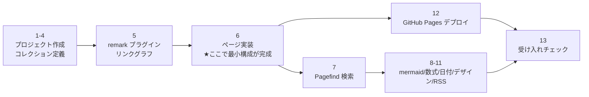

# ydah notes サイト 作業手順書

`design.md` の設計に沿って、Astro + GitHub Pages のノートサイトを構築する手順。
上から順に実行すれば動くところまで到達する。各ステップの末尾に**確認ポイント**を書いているので、
そこが通ってから次へ進むこと。

> 掲載しているコードは「そのまま動く完成品」ではなく**実装の出発点**。
> ライブラリの API は変わりうるので、詰まったら各公式ドキュメントを見ること。

---

## 0. 前提

| 必要なもの | 確認コマンド | 備考 |
|-----------|-------------|------|
| Node.js 22.12.0 以上 | `node -v` | mise / nvm で管理してよい |
| npm | `npm -v` | pnpm でも可。以降 npm 前提で書く |
| git | `git --version` | |
| GitHub アカウント | | Pages を有効化できる権限 |

**最初に決めること**（これで `astro.config.mjs` の書き方が変わる）:

- **A: ユーザーサイト** — リポジトリ名 `ydah.github.io` → 公開 URL は `https://ydah.github.io/`、`base` 不要。
- **B: プロジェクトサイト** — リポジトリ名 `notes` など → 公開 URL は `https://ydah.github.io/notes/`、**`base: '/notes'` が必須**。
- **C: 独自ドメイン** — `public/CNAME` にドメインを書く。`base` 不要。

このリポジトリは **B: プロジェクトサイト**（`https://ydah.github.io/notes/`）として構築する。以下のサンプルを実際に使う場合は、`base: '/notes'` を設定する。

以降、B を選んだ場合に必要な追加作業には 🅑 マークを付ける。本プロジェクトではBの手順を使う。

---

## 1. プロジェクトを作る

```sh
npm create astro@latest ydah-notes
```

対話では以下を選ぶ。

- テンプレート: **Empty**（ブログテンプレートは後で剥がすほうが面倒）
- TypeScript: **Yes（Strict）**
- 依存インストール: Yes
- git リポジトリ初期化: Yes

```sh
cd ydah-notes
npm run dev   # http://localhost:4321 が開けば OK
```

**確認**: ブラウザで Astro の初期ページが表示される。

---

## 2. 依存パッケージを入れる

```sh
# Markdown 拡張
npm i remark-math rehype-katex katex unist-util-visit

# サイト機能
npm i @astrojs/sitemap @astrojs/rss

# 検索
npm i -D pagefind
```

`package.json` の `scripts` を書き換える。

```json
{
  "scripts": {
    "dev": "astro dev",
    "build": "astro build && pagefind --site dist",
    "preview": "astro preview",
    "search:dev": "npm run build && rm -rf public/pagefind && cp -r dist/pagefind public/pagefind"
  }
}
```

`.gitignore` に追記する。

```
dist/
public/pagefind/
.astro/
node_modules/
```

**確認**: `npm run build` がエラーなく終わり、`dist/pagefind/` が生成される。

---

## 3. `astro.config.mjs` を書く

```js
import { defineConfig } from 'astro/config';
import sitemap from '@astrojs/sitemap';
import remarkMath from 'remark-math';
import rehypeKatex from 'rehype-katex';
import { remarkWikilink } from './src/lib/remark-wikilink.mjs';
import { remarkHashtag } from './src/lib/remark-hashtag.mjs';
import { buildNoteIndex } from './src/lib/note-index.mjs';

// ビルド開始時に「slug → title」の索引を同期的に作る（wikilink のタイトル解決用）
const noteIndex = buildNoteIndex('./src/content/notes');

const BASE = '/notes';    // このリポジトリはプロジェクトサイトとして公開

export default defineConfig({
  site: 'https://ydah.github.io',   // 🅑 プロジェクトサイトでも site はドメインまで
  base: BASE || undefined,
  trailingSlash: 'always',
  integrations: [sitemap()],
  markdown: {
    remarkPlugins: [
      [remarkWikilink, { index: noteIndex, base: BASE }],
      [remarkHashtag, { base: BASE }],
      remarkMath,
    ],
    rehypePlugins: [rehypeKatex],
    shikiConfig: {
      themes: { light: 'github-light', dark: 'github-dark' },
      wrap: true,
    },
  },
});
```

> 🅑 `base` を設定したら、**自分でリンクを組み立てているところ全部**に base を前置する。
> Astro の `<a href="/notes/">` は自動では base が付かない。`import.meta.env.BASE_URL` を使うこと。
> プロジェクトサイト構成で一番よく踏む罠がこれ。

**確認**: この時点ではまだ `src/lib/*` が無いので起動しない。次のステップで作る。

---

## 4. ノートのコレクションを定義する

`src/content.config.ts`:

```ts
import { defineCollection, z } from 'astro:content';
import { glob } from 'astro/loaders';

const notes = defineCollection({
  loader: glob({ pattern: '**/*.md', base: './src/content/notes' }),
  schema: z.object({
    title: z.string().optional(),
    created: z.coerce.date().optional(),
    updated: z.coerce.date().optional(),
    draft: z.boolean().default(false),
    aliases: z.array(z.string()).default([]),
  }),
});

export const collections = { notes };
```

テスト用のノートを 2 本置く。

`src/content/notes/evergreen-notes.md`:

```markdown
---
title: エバーグリーンノート
---

# エバーグリーンノート

使い捨てのメモではなく、時間をかけて育てるノートのこと。
関連: [[moc|ハブノート]]

#zettelkasten #note-taking
```

`src/content/notes/moc.md`:

```markdown
---
title: MOC (Map of Content)
---

# MOC (Map of Content)

複数の原子ノートを束ねる見取り図ノート。[[evergreen-notes]] の運用で使う。

#zettelkasten #moc
```

**確認**: このあとページを作れば 2 本が表示されるようになる。

---

## 5. ユーティリティと remark プラグインを実装する

### 5-1. `src/lib/note-index.mjs`（slug → title の索引）

```js
import fs from 'node:fs';
import path from 'node:path';

/** ビルド時に一度だけ実行。wikilink のタイトル解決に使う */
export function buildNoteIndex(dir) {
  const index = new Map();     // key: slug または alias, value: { slug, title }
  for (const file of fs.readdirSync(dir)) {
    if (!file.endsWith('.md')) continue;
    const slug = file.replace(/\.md$/, '');
    const raw = fs.readFileSync(path.join(dir, file), 'utf8');
    const fmTitle = raw.match(/^---\r?\n[\s\S]*?^title:\s*(.+?)\s*$/m)?.[1];
    const h1 = raw.match(/^#\s+(.+)$/m)?.[1];
    const title = (fmTitle ?? h1 ?? slug).replace(/^["']|["']$/g, '');
    const entry = { slug, title };
    index.set(slug, entry);
    // aliases: [a, b] 形式の簡易パース
    const aliases = raw.match(/^aliases:\s*\[(.*?)\]/m)?.[1];
    if (aliases) {
      for (const a of aliases.split(',')) {
        const key = a.trim().replace(/^["']|["']$/g, '');
        if (key) index.set(key, entry);
      }
    }
  }
  return index;
}
```

### 5-2. `src/lib/tags.mjs`（タグ抽出の共通ロジック）

remark プラグインと、一覧ページ用の集計の**両方から使う**ので独立させる。

```js
// #の直前が ASCII 英数字なら無効。#の直後は Unicode の「文字」。
export const TAG_RE = /(^|[^A-Za-z0-9])#(\p{L}[\p{L}\p{N}_-]*)/gu;

/** 英字を含むタグは小文字化。日本語はそのまま */
export function normalizeTag(tag) {
  return /[A-Za-z]/.test(tag) ? tag.toLowerCase() : tag;
}

export function tagUrl(tag, base = '') {
  return `${base}/tags/${encodeURIComponent(normalizeTag(tag))}/`;
}

/** 生 Markdown からタグを抽出（コード・数式は除外してから適用） */
export function extractTags(markdown) {
  const stripped = markdown
    .replace(/^---\r?\n[\s\S]*?\r?\n---/, '')      // frontmatter
    .replace(/```[\s\S]*?```/g, '')                // フェンス付きコード
    .replace(/`[^`\n]*`/g, '')                     // インラインコード
    .replace(/\$\$[\s\S]*?\$\$/g, '');             // ディスプレイ数式
  const found = new Set();
  for (const m of stripped.matchAll(TAG_RE)) found.add(normalizeTag(m[2]));
  return [...found];
}
```

### 5-3. `src/lib/remark-wikilink.mjs`

```js
import { visit } from 'unist-util-visit';

const WIKILINK = /\[\[([^[\]|]+?)(?:\|([^[\]]+?))?\]\]/g;

export function remarkWikilink({ index, base = '' }) {
  return (tree, file) => {
    visit(tree, 'text', (node, i, parent) => {
      if (!parent || parent.type === 'link' || !node.value.includes('[[')) return;

      const children = [];
      let last = 0;
      for (const m of node.value.matchAll(WIKILINK)) {
        if (m.index > last) children.push({ type: 'text', value: node.value.slice(last, m.index) });

        const target = m[1].trim();
        const label = m[2]?.trim();
        const hit = index.get(target);
        if (!hit) {
          // 存在しないリンクはビルドログに警告を出す（壊れリンクの検知）
          file.message(`未解決の wikilink: [[${target}]]`, node);
        }
        children.push({
          type: 'link',
          url: `${base}/notes/${hit?.slug ?? target}/`,
          data: { hProperties: { class: hit ? 'wikilink' : 'wikilink broken' } },
          children: [{ type: 'text', value: label ?? hit?.title ?? target }],
        });
        last = m.index + m[0].length;
      }
      if (!children.length) return;
      if (last < node.value.length) children.push({ type: 'text', value: node.value.slice(last) });

      parent.children.splice(i, 1, ...children);
      return i + children.length;
    });
  };
}
```

> `text` ノードだけを走査しているので、**コードブロック・インラインコード内の `[[...]]` は自動的に対象外**になる。
> 正規表現で生ソースを舐める実装より安全。

### 5-4. `src/lib/remark-hashtag.mjs`

```js
import { visit } from 'unist-util-visit';
import { TAG_RE, normalizeTag, tagUrl } from './tags.mjs';

export function remarkHashtag({ base = '' } = {}) {
  return (tree) => {
    visit(tree, 'text', (node, i, parent) => {
      if (!parent || parent.type === 'link' || !node.value.includes('#')) return;

      const children = [];
      let last = 0;
      for (const m of node.value.matchAll(TAG_RE)) {
        const start = m.index + m[1].length;   // '#' の位置
        if (start > last) children.push({ type: 'text', value: node.value.slice(last, start) });
        const tag = normalizeTag(m[2]);
        children.push({
          type: 'link',
          url: tagUrl(tag, base),
          data: { hProperties: { class: 'tag', 'data-pagefind-filter': 'tag' } },
          children: [{ type: 'text', value: `#${m[2]}` }],
        });
        last = start + 1 + m[2].length;
      }
      if (!children.length) return;
      if (last < node.value.length) children.push({ type: 'text', value: node.value.slice(last) });

      parent.children.splice(i, 1, ...children);
      return i + children.length;
    });
  };
}
```

### 5-5. `src/lib/notes.ts`（ノート取得・リンクグラフ・タグ集計）

```ts
import { getCollection, type CollectionEntry } from 'astro:content';
import { extractTags, normalizeTag } from './tags.mjs';

const WIKILINK = /\[\[([^[\]|]+?)(?:\|[^[\]]+?)?\]\]/g;

export type NoteMeta = {
  slug: string;
  title: string;
  created?: Date;
  updated?: Date;
  tags: string[];
  outgoing: string[];
  entry: CollectionEntry<'notes'>;
};

export async function getNotes(): Promise<NoteMeta[]> {
  const entries = await getCollection('notes', ({ data }) => import.meta.env.DEV || !data.draft);

  return entries.map((entry) => {
    const body = entry.body ?? '';
    const outgoing = [...body.matchAll(WIKILINK)].map((m) => m[1].trim());
    return {
      slug: entry.id,
      title: entry.data.title ?? body.match(/^#\s+(.+)$/m)?.[1] ?? entry.id,
      created: entry.data.created,
      updated: entry.data.updated,
      tags: extractTags(body),
      outgoing,
      entry,
    };
  });
}

/** slug → そこにリンクしているノート一覧 */
export async function getBacklinks() {
  const notes = await getNotes();
  const map = new Map<string, NoteMeta[]>();
  for (const note of notes) {
    for (const target of new Set(note.outgoing)) {
      if (!map.has(target)) map.set(target, []);
      map.get(target)!.push(note);
    }
  }
  return map;
}

/** タグ → そのタグを持つノート一覧（出現数降順で使う） */
export async function getTagMap() {
  const notes = await getNotes();
  const map = new Map<string, NoteMeta[]>();
  for (const note of notes) {
    for (const tag of note.tags) {
      const key = normalizeTag(tag);
      if (!map.has(key)) map.set(key, []);
      map.get(key)!.push(note);
    }
  }
  return map;
}

export const byUpdated = (a: NoteMeta, b: NoteMeta) =>
  (b.updated?.getTime() ?? 0) - (a.updated?.getTime() ?? 0);
```

> **なぜタグ抽出を 2 系統持つのか**: remark プラグインが注入したデータは
> レンダリング後（`render()` の `remarkPluginFrontmatter`）にしか取れず、一覧ページでの集計には使いにくい。
> 一覧・タグページ用には生ソース（`entry.body`）から抽出する `extractTags()` を使い、
> 本文の HTML 化は remark プラグインが担当する、という役割分担にする。正規表現は共有しているのでズレない。

**確認**: `npm run dev` がエラーなく起動する（まだページは無い）。

---

## 6. レイアウトとページを作る

### 6-1. `src/layouts/BaseLayout.astro`

```astro
---
import Sidebar from '../components/Sidebar.astro';
import '../styles/global.css';
import 'katex/dist/katex.min.css';
const { title } = Astro.props;
---
<!doctype html>
<html lang="ja">
  <head>
    <meta charset="utf-8" />
    <meta name="viewport" content="width=device-width, initial-scale=1" />
    <title>{title ? `${title} | ydah notes` : 'ydah notes'}</title>
    <script is:inline>
      // FOUC 防止のため同期実行
      const saved = localStorage.getItem('theme');
      const dark = saved ? saved === 'dark' : matchMedia('(prefers-color-scheme: dark)').matches;
      document.documentElement.dataset.theme = dark ? 'dark' : 'light';
    </script>
  </head>
  <body>
    <Sidebar />
    <main><slot /></main>
  </body>
</html>
```

### 6-2. `src/pages/notes/[slug].astro`

```astro
---
import { render } from 'astro:content';
import BaseLayout from '../../layouts/BaseLayout.astro';
import { getNotes, getBacklinks } from '../../lib/notes';
import { tagUrl } from '../../lib/tags.mjs';

export async function getStaticPaths() {
  const notes = await getNotes();
  return notes.map((note) => ({ params: { slug: note.slug }, props: { note } }));
}

const { note } = Astro.props;
const { Content, headings } = await render(note.entry);
const backlinks = (await getBacklinks()).get(note.slug) ?? [];
const base = import.meta.env.BASE_URL.replace(/\/$/, '');
---
<BaseLayout title={note.title}>
  <article data-pagefind-body>
    <h1 data-pagefind-meta="title">{note.title}</h1>
    <p class="dates">
      作成 {note.created?.toISOString().slice(0, 10)} / 更新 {note.updated?.toISOString().slice(0, 10)}
    </p>

    <!-- Pagefind のタグフィルタ用。本文中の #tag にも data-pagefind-filter が付く -->
    <ul class="tags">
      {note.tags.map((t) => (
        <li><a href={tagUrl(t, base)} data-pagefind-filter="tag">#{t}</a></li>
      ))}
    </ul>

    <Content />

    {backlinks.length > 0 && (
      <section class="backlinks" data-pagefind-ignore>
        <h2>🔗 リンクされているノート</h2>
        <ul>
          {backlinks.map((b) => <li><a href={`${base}/notes/${b.slug}/`}>{b.title}</a></li>)}
        </ul>
      </section>
    )}
  </article>

  <aside class="toc" data-pagefind-ignore>
    <ul>
      {headings.filter((h) => h.depth <= 3).map((h) => (
        <li class={`depth-${h.depth}`}><a href={`#${h.slug}`}>{h.text}</a></li>
      ))}
    </ul>
  </aside>
</BaseLayout>
```

### 6-3. `src/pages/tags/index.astro`（タグクラウド）

```astro
---
import BaseLayout from '../../layouts/BaseLayout.astro';
import { getTagMap } from '../../lib/notes';
import { tagUrl } from '../../lib/tags.mjs';

const tagMap = await getTagMap();
const tags = [...tagMap.entries()].sort((a, b) => b[1].length - a[1].length);
const max = tags[0]?.[1].length ?? 1;
const base = import.meta.env.BASE_URL.replace(/\/$/, '');
---
<BaseLayout title="タグ一覧">
  <h1>🏷️ タグ一覧</h1>
  <div class="tag-cloud">
    {tags.map(([tag, notes]) => (
      <a href={tagUrl(tag, base)} style={`font-size: ${0.9 + (notes.length / max) * 1.1}rem`}>
        #{tag} <small>{notes.length}</small>
      </a>
    ))}
  </div>
</BaseLayout>
```

### 6-4. `src/pages/tags/[tag].astro`

```astro
---
import BaseLayout from '../../layouts/BaseLayout.astro';
import { getTagMap } from '../../lib/notes';
import { byUpdated } from '../../lib/notes';

export async function getStaticPaths() {
  const tagMap = await getTagMap();
  return [...tagMap.entries()].map(([tag, notes]) => ({
    params: { tag },
    props: { tag, notes: notes.sort(byUpdated) },
  }));
}
const { tag, notes } = Astro.props;
const base = import.meta.env.BASE_URL.replace(/\/$/, '');
---
<BaseLayout title={`#${tag}`}>
  <h1>#{tag}</h1>
  <ul>
    {notes.map((n) => <li><a href={`${base}/notes/${n.slug}/`}>{n.title}</a></li>)}
  </ul>
</BaseLayout>
```

> **日本語タグの URL**: `params` には生のタグ文字列（`戦国時代`）を渡し、リンク側は `encodeURIComponent` した
> URL（`/tags/%E6%88%A6%E5%9B%BD%E6%99%82%E4%BB%A3/`）を使う。GitHub Pages は UTF-8 のパスを扱えるので通常は問題ないが、
> ステップ 12 のデプロイ後に**日本語タグのページが 404 にならないか必ず確認する**こと。
> もし問題が出たら `slugify` して ASCII の slug に落とす方式へ切り替える（表示名は元のまま持つ）。

`src/pages/index.astro` と `src/pages/notes/index.astro` も、`getNotes()` + `byUpdated` で同様に作る。

**確認**:
- `/notes/evergreen-notes/` が表示され、本文の `[[moc|ハブノート]]` がリンクになっている。
- `/notes/moc/` の下部に「🔗 リンクされているノート」として evergreen-notes が出る。
- `/tags/` にタグクラウドが出て、`/tags/zettelkasten/` に 2 本並ぶ。
- 存在しない `[[foo]]` を書くと、`npm run build` のログに「未解決の wikilink」が出る。

---

## 7. 検索（Pagefind）を組み込む

`src/pages/search.astro`:

```astro
---
import BaseLayout from '../layouts/BaseLayout.astro';
const base = import.meta.env.BASE_URL.replace(/\/$/, '');
---
<BaseLayout title="検索">
  <h1>🔍 検索</h1>
  <div id="search"></div>

  <link rel="stylesheet" href={`${base}/pagefind/pagefind-ui.css`} />
  <script is:inline define:vars={{ base }} src={`${base}/pagefind/pagefind-ui.js`}></script>
  <script is:inline define:vars={{ base }}>
    window.addEventListener('DOMContentLoaded', () => {
      new PagefindUI({
        element: '#search',
        bundlePath: `${base}/pagefind/`,
        showSubResults: true,
        showImages: false,
        translations: { placeholder: 'ノートを検索', zero_results: '「[SEARCH_TERM]」に一致するノートはありません' },
      });
    });
  </script>
</BaseLayout>
```

- **タグ絞り込み**は、ステップ 5-4 と 6-2 で付けた `data-pagefind-filter="tag"` により、
  Pagefind UI 側にフィルタ用のチェックボックスが自動で出る。
- サイドバー・目次・バックリンクなど本文以外は `data-pagefind-ignore` を付けて検索対象から外す。
- 検索対象は `data-pagefind-body` を付けた `<article>` のみ。

### 開発サーバで検索を試したいとき

`astro dev` は `dist/` を作らないのでインデックスが無い。一度だけ次を実行する。

```sh
npm run search:dev   # build → dist/pagefind を public/ にコピー
```

**確認**: `npm run build && npm run preview` で `/search/` を開き、
ノート本文の単語で検索してヒットする。タグのチェックボックスで絞り込める。

---

## 8. mermaid と数式

### 数式

ステップ 3 で remark-math + rehype-katex を入れ、`BaseLayout` で `katex.min.css` を import 済み。
**ビルド時に HTML 化される**ので、閲覧側で JS は不要。

```markdown
インライン: $E = mc^2$

$$
\int_0^\infty e^{-x^2}\,dx = \frac{\sqrt{\pi}}{2}
$$
```

> 64p.org 版はインライン数式に `\(...\)` を使っていたが、remark-math の標準は `$...$`。
> 既存ノートを移行する場合は `\(...\)` → `$...$` の置換が要る。

### mermaid

remark プラグインは書かず、**クライアントサイドで遅延ロード**する。
`src/components/Mermaid.astro` 相当のスクリプトを `BaseLayout` に足す。

```astro
<script>
  const blocks = document.querySelectorAll('pre > code.language-mermaid');
  if (blocks.length) {
    const mermaid = (await import('https://cdn.jsdelivr.net/npm/mermaid@11/dist/mermaid.esm.min.mjs')).default;
    blocks.forEach((code) => {
      const div = document.createElement('div');
      div.className = 'mermaid';
      div.textContent = code.textContent;
      code.parentElement.replaceWith(div);
    });
    const theme = document.documentElement.dataset.theme === 'dark' ? 'dark' : 'default';
    mermaid.initialize({ startOnLoad: true, theme });
  }
</script>
```

- mermaid ブロックがあるページでのみ CDN から読み込まれる。
- テーマ切替時に再レンダリングしたい場合は、テーマ変更イベントで `mermaid.initialize` + `mermaid.run()` を呼び直す。

**確認**: mermaid ブロックを含むノートを作り、図が描画される。数式が KaTeX で組まれる。

---

## 9. 作成日・更新日の自動付与

`scripts/update-note-dates.mjs`:

```js
#!/usr/bin/env node
import fs from 'node:fs';
import { execSync } from 'node:child_process';

const today = new Date().toISOString().slice(0, 10);

for (const file of process.argv.slice(2)) {
  if (!file.endsWith('.md') || !fs.existsSync(file)) continue;
  const raw = fs.readFileSync(file, 'utf8');

  // git 履歴があれば既存ファイル
  let tracked = true;
  try {
    tracked = execSync(`git log --oneline -1 -- "${file}"`, { encoding: 'utf8' }).trim() !== '';
  } catch { tracked = false; }

  const hasFm = raw.startsWith('---');
  let next;
  if (!hasFm) {
    next = `---\ncreated: ${today}\nupdated: ${today}\n---\n\n${raw}`;
  } else {
    const [, fm, body] = raw.match(/^---\r?\n([\s\S]*?)\r?\n---\r?\n?([\s\S]*)$/);
    let lines = fm.split('\n').filter((l) => !/^updated:/.test(l));
    if (!lines.some((l) => /^created:/.test(l))) lines.unshift(`created: ${tracked ? today : today}`);
    lines.push(`updated: ${today}`);
    next = `---\n${lines.join('\n')}\n---\n${body}`;
  }

  if (next !== raw) fs.writeFileSync(file, next);
}
```

`lefthook.yml`:

```yaml
pre-commit:
  commands:
    update-note-dates:
      glob: "src/content/notes/*.md"
      run: node scripts/update-note-dates.mjs {staged_files} && git add {staged_files}
```

```sh
npm i -D lefthook
npx lefthook install
```

**確認**: ノートを 1 行編集して `git commit` すると、frontmatter の `updated` が当日に書き換わっている。

---

## 10. デザインを整える

`src/styles/global.css` の骨格。色は CSS 変数に寄せ、`[data-theme="dark"]` で上書きする。

```css
:root {
  --bg: #ffffff;
  --fg: #1f2328;
  --muted: #656d76;
  --link: #0969da;
  --link-broken: #cf222e;
  --border: #d0d7de;
  --code-bg: #f6f8fa;
  --sidebar-bg: #f6f8fa;
}
[data-theme='dark'] {
  --bg: #14161a;
  --fg: #e6edf3;
  --muted: #9198a1;
  --link: #6cb6ff;
  --link-broken: #ff7b72;
  --border: #2c313a;
  --code-bg: #1c2027;
  --sidebar-bg: #1a1d22;
}

body {
  margin: 0;
  display: grid;
  grid-template-columns: 260px minmax(0, 1fr);
  background: var(--bg);
  color: var(--fg);
  font-family: system-ui, -apple-system, 'Hiragino Sans', 'Noto Sans JP', sans-serif;
  line-height: 1.8;                 /* 日本語本文は広めに */
}
main { max-width: 46em; padding: 2rem 2.5rem; }

a.wikilink { color: var(--link); text-decoration: none; border-bottom: 1px solid color-mix(in srgb, var(--link) 40%, transparent); }
a.wikilink.broken { color: var(--link-broken); border-bottom-style: dotted; }
a.tag { color: var(--muted); font-size: 0.9em; text-decoration: none; }

@media (max-width: 1100px) { .toc { display: none; } }
@media (max-width: 768px)  { body { grid-template-columns: 1fr; } }
```

やること:

- [ ] 左サイドバー（検索リンク・ノート一覧・タグ一覧・テーマ切替）
- [ ] 右カラムの目次（`position: sticky`）
- [ ] テーマ切替ボタン（`localStorage` に保存 → `document.documentElement.dataset.theme` を更新）
- [ ] 未解決 wikilink の見た目を区別（上の `.broken`）
- [ ] スマホでサイドバーをハンバーガーに畳む

**確認**: スマホ幅で本文が読める。テーマを切り替えてリロードしても維持される。

---

## 11. RSS と sitemap

`src/pages/rss.xml.ts`:

```ts
import rss from '@astrojs/rss';
import { getNotes, byUpdated } from '../lib/notes';

export async function GET(context) {
  const notes = (await getNotes()).sort(byUpdated);
  return rss({
    title: 'ydah notes',
    description: 'ydah のノート置き場',
    site: context.site,
    items: notes.map((n) => ({
      title: n.title,
      pubDate: n.updated ?? n.created,
      link: `/notes/${n.slug}/`,
    })),
  });
}
```

sitemap はステップ 3 で `integrations: [sitemap()]` を入れているのでビルド時に自動生成される。

**確認**: `dist/rss.xml` と `dist/sitemap-index.xml` が生成される。

---

## 12. GitHub Pages にデプロイする

### 12-1. リポジトリを作って push

```sh
git remote add origin git@github.com:ydah/notes.git
git branch -M main
git push -u origin main
```

### 12-2. `.github/workflows/deploy.yml`

```yaml
name: Deploy to GitHub Pages

on:
  push:
    branches: [main]
  workflow_dispatch:

permissions:
  contents: read
  pages: write
  id-token: write

concurrency:
  group: pages
  cancel-in-progress: false

jobs:
  build:
    runs-on: ubuntu-latest
    steps:
      - uses: actions/checkout@v6
      - uses: actions/setup-node@v6
        with:
          node-version: 22
          cache: npm
      - run: npm ci
      - name: Build
        env:
          PUBLIC_BASE: /notes
          SITE_URL: https://ydah.github.io
        run: npm run build        # astro build && pagefind --site dist
      - uses: actions/upload-pages-artifact@v4
        with:
          path: ./dist

  deploy:
    needs: build
    runs-on: ubuntu-latest
    environment:
      name: github-pages
      url: ${{ steps.deployment.outputs.page_url }}
    steps:
      - id: deployment
        uses: actions/deploy-pages@v4
```

### 12-3. Pages の設定

GitHub のリポジトリ → **Settings → Pages → Build and deployment → Source** を **GitHub Actions** にする。
（"Deploy from a branch" のままだと Actions の成果物が反映されない）

### 12-4. 🅑 プロジェクトサイトの場合

- `astro.config.mjs` の `base` を `'/リポジトリ名'` にする。
- 自作リンクに `import.meta.env.BASE_URL` が入っているか総点検する。
- Pagefind の `bundlePath` にも base が入っているか確認する（ステップ 7）。

### 12-5. 独自ドメインの場合

- `public/CNAME` にドメイン名を 1 行で書く（`dist/CNAME` にコピーされる）。
- DNS に CNAME / A レコードを設定し、Settings → Pages で Custom domain を入力、Enforce HTTPS を有効化。

**確認**: push 後に Actions が緑になり、公開 URL でサイトが見える。

---

## 13. 受け入れチェックリスト

デプロイ後、公開 URL で以下を確認する。**ローカルで通っても base 絡みで本番だけ壊れることがある**ので必ず本番で。

- [ ] トップページが表示され、CSS が当たっている（当たっていない → `base` の設定漏れ）
- [ ] ノートページが開ける / 相互リンクを踏んで往復できる
- [ ] バックリンクが表示される
- [ ] `#tag` がリンクになっていて、タグページに飛べる
- [ ] **日本語タグのページが 404 にならない**
- [ ] `/tags/` のタグクラウドが出る
- [ ] `/search/` で検索がヒットする（404 なら Pagefind の `bundlePath`）
- [ ] 検索結果をタグで絞り込める
- [ ] mermaid の図が描画される / 数式が組まれる
- [ ] コードブロックに色が付く
- [ ] テーマ切替が動き、リロード後も維持される
- [ ] スマホ幅で読める
- [ ] 存在しないパスで 404 ページが出る
- [ ] `/rss.xml`、`/sitemap-index.xml` が返る

---

## 14. 日々の運用手順

```sh
# 1. ノートを書く（ファイル名は英数字とハイフンの kebab-case）
$EDITOR src/content/notes/perl-signal-handling.md

# 2. 既存ノートに関連する記述がないか探し、あれば [[...]] でリンクする（原則3: 密度の高いリンク）
grep -rn "シグナル" src/content/notes/

# 3. ローカル確認（未解決の wikilink 警告もここで拾う）
npm run dev

# 4. コミット（lefthook が created/updated を付与）
git add src/content/notes/perl-signal-handling.md
git commit -m "add: perl-signal-handling"

# 5. push すれば Actions が回って公開される
git push
```

- md のみの変更ならブランチを切らず直接 main へ push してよい。
- テンプレート・ビルドロジック（`src/lib/`、`astro.config.mjs`、CI など）に手を入れた場合は PR を作る。
- 同じ分野の原子ノートが 3 つ前後たまったら、`#moc` タグ付きのハブノートを作る。

---

## 15. トラブルシューティング

| 症状 | 原因と対処 |
|------|-----------|
| 本番だけ CSS / リンクが壊れる | 🅑 `base` の設定漏れ、または自作リンクに `import.meta.env.BASE_URL` が入っていない |
| `/search/` で検索 UI が出ない | `dist/pagefind/` が無い（`npm run build` が `pagefind` まで走っていない）。CI で `withastro/action` を使うと postbuild が走らないことがあるので、手書きの workflow にする |
| dev サーバで検索が動かない | 仕様。`npm run search:dev` で `public/pagefind/` を用意する |
| タグが 1 件も拾えない | `TAG_RE` の Unicode フラグ `u` 抜け、または `#` の直前が ASCII 英数字になっている |
| コード例の中の `#include` がタグ化される | `text` ノード以外を走査してしまっている。remark プラグインの visit 対象を確認 |
| バックリンクが出ない | `getNotes()` の wikilink 正規表現が `[[a|b]]` 形式の `|` を拾えていない |
| ビルドは通るがリンク先が 404 | wikilink のターゲット名とファイル名が不一致。ビルドログの「未解決の wikilink」警告を確認 |
| 日付が全ノート同じ | `git log` 方式に切り替えていて `actions/checkout` に `fetch-depth: 0` が無い |
| 日本語タグの URL が 404 | `encodeURIComponent` の有無を確認。解決しなければ ASCII slug 方式に変更（表示名は別に持つ） |
| Actions は緑なのに反映されない | Settings → Pages の Source が "GitHub Actions" になっていない |

---

## 16. 作業順のまとめ

まずは **1 → 6 まで**（ノートが表示され、相互リンクとタグが動く）を通すことを目標にする。
ここまでで「知識のネットワーク」としては成立する。検索・デザイン・CI はその後で足せばよい。


