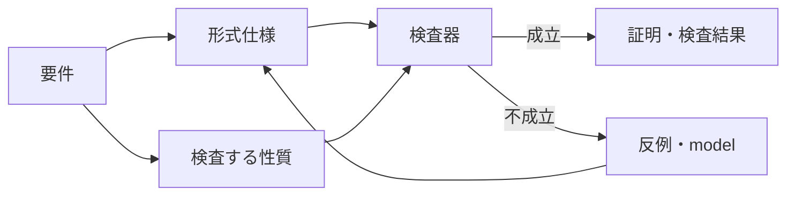

# 形式手法

#formal-methods #formal-verification #software-engineering #moc

形式手法は、ソフトウェアやシステムを数学的な記法で表し、その性質を厳密に調べる技法の総称。対象の[[formal-specification|形式仕様]]と満たしたい性質を定義し、自然言語の要件を機械的に扱える形へ変える。

$$
S \models P
$$

[[formal-verification|形式検証]]では、仕様 $S$ が性質 $P$ を満たすかを調べる。前提の抜けや曖昧な状態遷移も検査対象になる。

## 何を形式化するか

- [[state-transition-system|状態遷移系]] — 状態、初期状態、許される遷移
- [[safety-property|安全性]] — 「悪いことが起きない」
- [[liveness-property|活性]] — 「良いことがいつか起きる」
- [[invariant|不変条件]] — すべての到達可能状態で保たれる述語

形式手法は、要件、設計、実装のどの段階にも適用できる。コードを対象にしない設計レベルのモデルでも、並行処理や分散プロトコルの状態遷移を実装前に検討できる。

## 関連する概念

| 概念 | 何をするか | 得やすい結果 | 主な制約 |
| --- | --- | --- | --- |
| [[formal-specification]] | 状態・遷移・制約を論理式などで記述する | 曖昧さや前提の可視化 | 記述しただけでは正しさを保証しない |
| [[model-checking]] | 到達可能な状態を探索して性質を検査する | 反例となる実行経路 | 状態爆発、有限化・抽象化 |
| [[automated-theorem-proving]] | proofを自動探索する | 証明、反例、判定結果 | 対象logicによって完全性が異なる |
| [[smt-solver]] | 背景theoryのもとで充足可能性を解く | `sat`、`unsat`、model | 扱えるlogicやtheoryに制約がある |
| [[interactive-theorem-proving]] | 人が証明を組み立て、kernelが検査する | 機械検査済みの証明 | 仕様化と証明に手間がかかる |

[[proof-assistant|Proof assistant]]は対話的定理証明の作業環境で、[[rocq|Rocq]]やLeanが具体例。

## テストとの違い

テストは選んだ入力や実行経路で実装を動かす。[[formal-verification|形式検証]]は形式化した対象の範囲で、性質がすべての対象ケースに成り立つかを数学的に調べる。

検証が成立しても、仕様が現実の要件を表すか、実装が仕様どおりかは別に確認する。形式手法はテストを置き換えず、異なる種類の誤りを見つける手段として組み合わせる。

## 出典

- [Formal Methods Specification and Verification Guidebook — NASA](https://ntrs.nasa.gov/archive/nasa/casi.ntrs.nasa.gov/19980228002.pdf)
- [A High-Level View of TLA+ — Leslie Lamport](https://lamport.azurewebsites.net/tla/high-level-view.html)
- [Rocq core language](https://docs.rocq-prover.org/master/refman/language/core/index.html)
