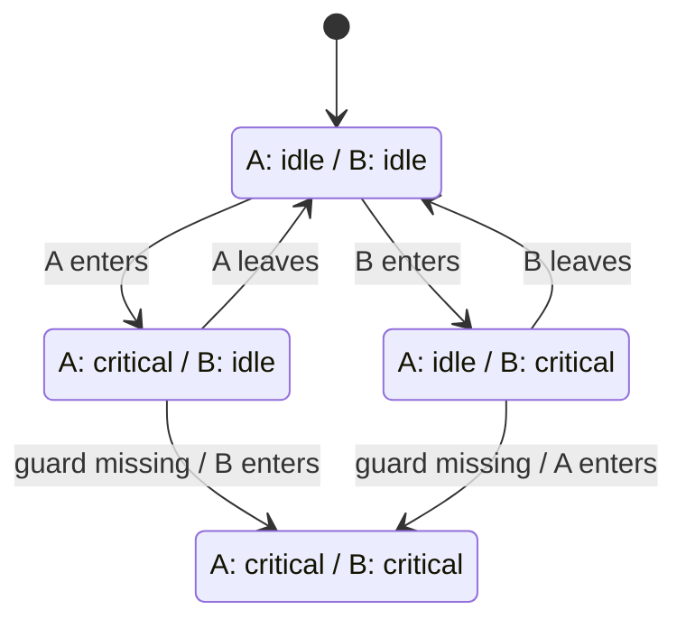

# モデル検査

#formal-methods #formal-verification #model-checking #moc

有限の[[state-transition-system|状態遷移系]]について、期待する性質が成り立つかを[[state-space|状態空間]]の探索によって自動検査する[[formal-methods|形式手法]]。有限状態へ[[model-abstraction|抽象化]]したシステムも対象になる。

モデルを $M$、検査する性質を $P$ とすると、model checkerは次を判定する。

$$
M \models P
$$

成立しなければ、性質を破る状態遷移の列を[[counterexample|反例]]として返す。「どの順番で遷移すると壊れるか」も得られるため、並行処理や通信プロトコルの調査に使いやすい。

## [[formal-methods|形式手法]]の中での位置づけ

形式仕様の状態空間を自動探索し、性質の成立または反例を得る検証方法。

## 検査の流れ

1. 初期状態から開始する。
2. 遷移規則を適用し、到達可能な[[state-space|状態空間]]を生成する。
3. 各状態や実行経路が性質を満たすか調べる。
4. 違反があれば[[counterexample|反例]]を返し、探索を完了できればmodelの範囲で成立とする。

検査対象には「悪い状態へ到達しない」という[[safety-property|安全性]]や、「要求がいつか処理される」という[[liveness-property|活性]]がある。

## 小さな例

2つのプロセス $A, B$ が、それぞれ `idle` または `critical` にいる状態機械を考える。守りたい[[safety-property|安全性]]は、次の[[invariant|不変条件]]になる。

$$
\neg(A = \mathrm{critical} \land B = \mathrm{critical})
$$

「相手が `idle` のときだけ `critical` へ移る」というguardがあれば、違反状態には到達しない。guardが抜けていれば、model checkerは違反状態への遷移列を返す。

ただし、このモデルにはクラッシュ、メモリモデル、通信遅延などを含めていない。モデル上で不変条件が成立しても、省略した振る舞いまで検査したことにはならない。

## 探索方法

- [[explicit-state-model-checking]]: 個々の状態を生成・保存して探索する。
- [[symbolic-model-checking]]: 状態集合と遷移関係を記号表現でまとめて扱う。
- [[bounded-model-checking]]: 実行長などに上限を置いて反例を探す。

Alloy Analyzerは厳密には[[model-finder|model finder]]で、指定した有限scope内のinstanceを探す。

## 状態爆発

[[state-explosion|状態爆発]]により、変数、thread、queueの要素数を増やすだけでも時間やメモリが先に尽きることがある。

[[model-abstraction|モデル抽象化]]、[[symmetry-reduction|対称性削減]]、[[partial-order-reduction|部分順序削減]]、[[bounded-model-checking|探索範囲の制限]]などで状態数を抑える。

## テストとの違い

テストは選んだ入力と実行scheduleで実装を動かす。モデル検査はモデルが許す入力やscheduleを系統的に探索するため、再現しにくいthread interleavingも反例として得られる。

検査結果が直接保証するのはモデルについての性質である。実装とモデルの対応、環境の仮定と現実の一致、探索の完了は別に確認する。

## 出典

- [Model Checking — My 27-year Quest to Overcome the State Explosion Problem](https://ntrs.nasa.gov/citations/20100024455)
- [Program Model Checking: A Practitioner's Guide — NASA](https://ntrs.nasa.gov/citations/20080015887)
- [Model Checking TLA+ Specifications](https://lamport.azurewebsites.net/pubs/yuanyu-model-checking.pdf)
- [TLA+ Tools](https://lamport.azurewebsites.net/tla/tools.html)
- [Alloy: What kind of analysis does the Alloy Analyzer do?](https://alloytools.org/faq/what_kind_of_analysis_does_the_alloy_analyzer_do.html)
